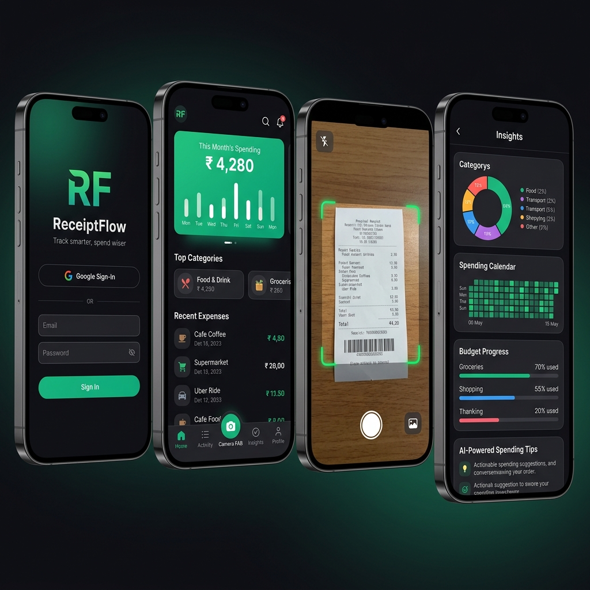
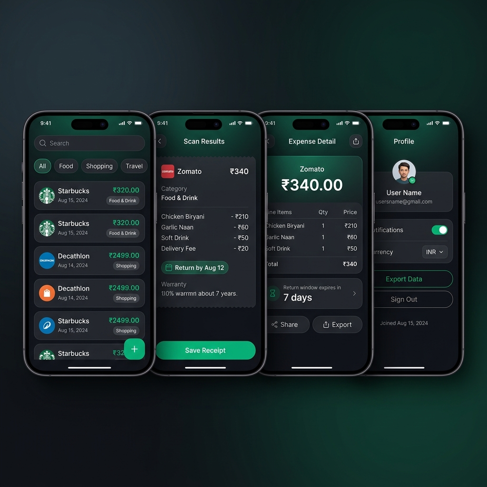

<p align="center">
  
</p>

<h1 align="center">ReceiptFlow</h1>

<p align="center">
  <strong>AI-powered receipt scanning and expense tracking for your pocket</strong>
</p>

<p align="center">
  <a href="#features">Features</a> •
  <a href="#tech-stack">Tech Stack</a> •
  <a href="#project-structure">Project Structure</a> •
  <a href="#getting-started">Getting Started</a> •
  <a href="#api-reference">API Reference</a> •
  <a href="#screenshots">Screenshots</a>
</p>

<p align="center">
  
  
  
  
  
</p>

## Table of Contents

- [Overview](#overview)
- [Features](#features)
- [Tech Stack](#tech-stack)
- [Project Structure](#project-structure)
- [Getting Started](#getting-started)
- [API Reference](#api-reference)
- [Screenshots](#screenshots)
- [Deployment](#deployment)
- [Cron Jobs](#cron-jobs)
- [Environment Variables Reference](#environment-variables-reference)
- [Contributing](#contributing)
- [License](#license)

## Why ReceiptFlow?

ReceiptFlow brings receipt scanning, expense organization, and financial insights into one polished mobile experience. Instead of manually typing every purchase, you can capture a receipt, let AI extract the important details, and immediately review your spending habits in a clean dashboard.

### Quick Start at a Glance

- Capture a receipt with your camera or upload one from your gallery
- Extract merchant, totals, line items, category, and return details with AI
- Review your spending in the dashboard and manage budgets and alerts
- Sync everything through a secure backend and keep your data organized

---

## Overview

**ReceiptFlow** is a full-stack mobile application that turns physical receipts into structured, searchable financial data — instantly. Point your camera at any receipt and let Google Gemini's AI extract merchant name, total amount, line items, category, return window, and warranty details automatically. All your spending data lives in one beautiful, insight-driven dashboard designed to make expense tracking feel effortless.

---

## Features

### 📷 AI Receipt Scanning
- **Instant OCR via Gemini 2.5 Flash** — snap or upload a receipt to extract all key data in seconds
- **Smart fallback** — automatically switches to `gemini-2.5-flash-lite` on rate limits with exponential backoff
- **Gallery import** — pick receipts from your photo library, not just live camera
- **Return & warranty tracking** — auto-calculates return window deadlines and warranty expiry dates

### 📊 Dashboard & Analytics
- **Monthly spending hero card** — glanceable summary with a mini bar chart for daily trends
- **Category breakdown** — top spending categories with visual progress bars
- **All-time totals** — track cumulative spending across all receipts
- **Recent expenses feed** — quick access to your latest transactions

### 📋 Activity & Expense Management
- **Full expense history** — searchable, filterable list of all receipts
- **Expense detail view** — line-by-line breakdown with return window countdown
- **Manual entry** — add expenses without a receipt
- **Split bills** — split any expense with others via the split modal
- **Export data** — share your expense history as a file

### 📈 Insights & Budgets
- **Spending calendar heatmap** — visualize daily spending patterns over time
- **Category budget tracking** — set monthly limits per category with real-time progress
- **Price inflation tracker** — detect if you are paying more for recurring items
- **Recurring expense detection** — auto-identify subscriptions and habitual spending
- **Top merchants** — see where you spend the most
- **AI spending tips** — personalized recommendations based on your habits

### 🔔 Smart Notifications
- **Return window alerts** — push notification 3 days before a return window closes
- **Warranty expiry alerts** — reminder 3 days before warranty expires
- **In-app notification center** — read/unread badge on the bell icon

### 🔐 Authentication
- **Google OAuth** — one-tap sign-in with Google
- **Email/password** — traditional sign-in and sign-up flow
- **Clerk-powered** — secure session management and JWT authentication

---

## Tech Stack

| Layer | Technology |
|-------|-----------|
| **Mobile** | React Native + Expo (SDK 54) |
| **Routing** | Expo Router (file-based) |
| **Auth** | Clerk (OAuth + Email/Password) |
| **Backend** | Node.js + Express 5 |
| **Database** | Supabase (PostgreSQL) |
| **AI / OCR** | Google Gemini 2.5 Flash |
| **Push Notifications** | Expo Notifications + expo-server-sdk |
| **File Upload** | Multer (in-memory) |
| **Scheduled Jobs** | node-cron |
| **Webhooks** | Svix (Clerk webhook verification) |
| **Deployment** | Render (backend) + EAS Build (mobile) |

---

## Project Structure

```
ReceiptFlow/
├── backend/                      # Express API server
│   ├── src/
│   │   ├── index.js              # Server entry, cron jobs, middleware
│   │   ├── middleware/
│   │   │   └── requireAuth.js    # Clerk JWT verification middleware
│   │   └── routes/
│   │       ├── scan.js           # POST /api/scan — AI receipt processing
│   │       ├── expenses.js       # CRUD for expenses + stats
│   │       ├── insights.js       # Analytics: inflation, recurring, calendar
│   │       ├── budgets.js        # Budget management per category
│   │       ├── notifications.js  # In-app notifications
│   │       ├── profile.js        # User profile management
│   │       └── webhooks.js       # Clerk webhook handler (user sync)
│   ├── .env.example
│   └── package.json
│
└── frontend/                     # Expo React Native app
    ├── app/
    │   ├── _layout.tsx           # Root layout (auth guard)
    │   ├── (auth)/
    │   │   └── login.tsx         # Login / Sign-up screen
    │   └── (app)/
    │       ├── _layout.tsx       # Tab navigator + center scanner FAB
    │       ├── index.tsx         # Dashboard (Home tab)
    │       ├── activity.tsx      # Expense history (Activity tab)
    │       ├── scanner.tsx       # Camera scanner screen
    │       ├── results.tsx       # Scan results and confirmation
    │       ├── insights.tsx      # Analytics and budgets (Insights tab)
    │       ├── profile.tsx       # User settings (Profile tab)
    │       ├── expense-detail.tsx   # Single expense view
    │       ├── manual-entry.tsx     # Manual expense form
    │       └── notifications.tsx   # Notification center
    ├── components/
    │   ├── BudgetCard.tsx        # Budget progress card component
    │   ├── CalendarHeatmap.tsx   # Spending heatmap calendar
    │   └── SplitModal.tsx        # Bill splitting modal
    ├── constants/
    │   ├── theme.ts              # Colors, fonts, shadows, border radii
    │   └── api.ts                # API base URL constant
    ├── .env.example
    └── package.json
```

---

## Getting Started

### Prerequisites

- [Node.js](https://nodejs.org/) v18+
- [Expo Go](https://expo.dev/go) app on your device (for development)
- Accounts for: [Clerk](https://clerk.com), [Supabase](https://supabase.com), [Google AI Studio](https://ai.google.dev)

---

### 1. Clone the Repository

```bash
git clone https://github.com/Nikhil18N/ReceiptFlow.git
cd ReceiptFlow
```

---

### 2. Backend Setup

```bash
cd backend
npm install
cp .env.example .env
```

Fill in your secrets in `backend/.env`:

```env
# Clerk — https://dashboard.clerk.com → API Keys → Secret Key
CLERK_SECRET_KEY=sk_test_your_secret_key_here

# Google Gemini — https://ai.google.dev → Get API Key
GOOGLE_GEMINI_API_KEY=your_gemini_api_key_here

# Supabase — https://supabase.com → Project Settings → API
SUPABASE_URL=https://your-project.supabase.co
SUPABASE_SERVICE_ROLE_KEY=your_service_role_key_here

PORT=3000
NODE_ENV=development
```

Start the backend:

```bash
npm run dev    # Development (with file watching)
npm start      # Production
```

Verify the server is running: `GET http://localhost:3000/health`

---

### 3. Frontend Setup

```bash
cd frontend
npm install
cp .env.example .env
```

Fill in `frontend/.env`:

```env
# https://dashboard.clerk.com → API Keys → Publishable Key
EXPO_PUBLIC_CLERK_PUBLISHABLE_KEY=pk_test_xxxxxxxxxxxxxxxxxxxxxxxxxxxxxxxx
```

Update `constants/api.ts` to point to your backend URL.

Start the Expo dev server:

```bash
npx expo start
```

Scan the QR code with Expo Go, or press `a` (Android) / `i` (iOS simulator).

---

### 4. Supabase Database Setup

Create these tables in your Supabase project:

| Table | Key Columns |
|-------|------------|
| `profiles` | `id` (PK), `updated_at` |
| `expenses` | `id`, `user_id`, `merchant_name`, `total_amount`, `date`, `category`, `line_items` (jsonb), `return_date`, `warranty_date` |
| `budgets` | `id`, `user_id`, `category`, `monthly_limit` |
| `notifications` | `id`, `user_id`, `type`, `title`, `body`, `icon`, `color`, `metadata`, `read` |
| `user_tokens` | `user_id`, `expo_push_token` |

> **Important:** Enable Row Level Security (RLS) on all tables and add policies so users can only access their own data.

---

## API Reference

All endpoints require a Bearer token from Clerk (except `/health` and `/webhooks/clerk`):

```
Authorization: Bearer <clerk_jwt>
```

### Scan

| Method | Endpoint | Description |
|--------|----------|-------------|
| `POST` | `/api/scan` | Upload receipt image — field: `image` (multipart/form-data) |

### Expenses

| Method | Endpoint | Description |
|--------|----------|-------------|
| `GET` | `/api/expenses` | List all expenses |
| `GET` | `/api/expenses/stats` | Dashboard stats (monthly total, categories, daily chart) |
| `POST` | `/api/expenses` | Create a manual expense |
| `PUT` | `/api/expenses/:id` | Update an expense |
| `DELETE` | `/api/expenses/:id` | Delete an expense |

### Insights

| Method | Endpoint | Description |
|--------|----------|-------------|
| `GET` | `/api/insights/inflation` | Price change detection for recurring items |
| `GET` | `/api/insights/recurring` | Identify recurring merchants/subscriptions |
| `GET` | `/api/insights/calendar` | Daily spending data for the heatmap |

### Budgets

| Method | Endpoint | Description |
|--------|----------|-------------|
| `GET` | `/api/budgets` | List budgets with current month spending |
| `POST` | `/api/budgets` | Create or update a category budget |
| `DELETE` | `/api/budgets/:id` | Delete a budget |

### Notifications

| Method | Endpoint | Description |
|--------|----------|-------------|
| `GET` | `/api/notifications` | List all notifications |
| `GET` | `/api/notifications/unread-count` | Get unread count |
| `PUT` | `/api/notifications/:id/read` | Mark one as read |
| `PUT` | `/api/notifications/read-all` | Mark all as read |

### Profile

| Method | Endpoint | Description |
|--------|----------|-------------|
| `GET` | `/api/profile` | Get user profile |
| `PUT` | `/api/profile` | Update profile name |
| `GET` | `/api/profile/export` | Export all expenses as JSON |

---

## Screenshots

### User Flow

<p align="center">
  
  <br/>
  <em>Login · Dashboard · Scanner · Insights</em>
</p>

<p align="center">
  
  <br/>
  <em>Activity · Scan Results · Expense Detail · Profile</em>
</p>

---

## Deployment

### Backend — Render

1. Push `backend/` to GitHub
2. Create a new **Web Service** on [Render](https://render.com)
3. Set **Build Command**: `npm install`
4. Set **Start Command**: `npm start`
5. Add all environment variables from `backend/.env.example` in the Render dashboard

> The server self-pings every 14 minutes to stay alive on Render's free tier.

### Mobile — EAS Build

```bash
cd frontend
npx eas build --platform android   # Build Android APK/AAB
npx eas build --platform ios       # Build iOS IPA
```

---

## Cron Jobs

Three scheduled tasks run on the backend:

| Schedule | Task |
|----------|------|
| Every 14 min | Self-ping Render health endpoint to prevent spin-down |
| Every 3 days at 6:00 AM | Ping Supabase to prevent free-tier project auto-pause |
| Daily at 8:00 AM | Send push notifications for return windows / warranties expiring in 3 days |

---

## Environment Variables Reference

### Backend (`backend/.env`)

| Variable | Description | Source |
|----------|-------------|--------|
| `CLERK_SECRET_KEY` | Clerk backend secret key | [Clerk Dashboard](https://dashboard.clerk.com) → API Keys |
| `GOOGLE_GEMINI_API_KEY` | Gemini AI API key | [Google AI Studio](https://ai.google.dev) |
| `SUPABASE_URL` | Supabase project URL | Supabase → Project Settings → API |
| `SUPABASE_SERVICE_ROLE_KEY` | Supabase service role key | Supabase → Project Settings → API |
| `PORT` | Server port (default: `3000`) | — |
| `NODE_ENV` | Environment (`development` / `production`) | — |

### Frontend (`frontend/.env`)

| Variable | Description | Source |
|----------|-------------|--------|
| `EXPO_PUBLIC_CLERK_PUBLISHABLE_KEY` | Clerk publishable key | [Clerk Dashboard](https://dashboard.clerk.com) → API Keys |

---

## Contributing

1. Fork the repository
2. Create a feature branch: `git checkout -b feature/amazing-feature`
3. Commit your changes: `git commit -m 'Add some amazing feature'`
4. Push to the branch: `git push origin feature/amazing-feature`
5. Open a Pull Request

Contributions are welcome. Whether you want to fix a bug, improve the UX, or add a new feature, your help is appreciated.

---

## License

This project is licensed under the **ISC License**.

---

<p align="center">
  Built with ❤️ using React Native, Expo, and Google Gemini AI
</p>
